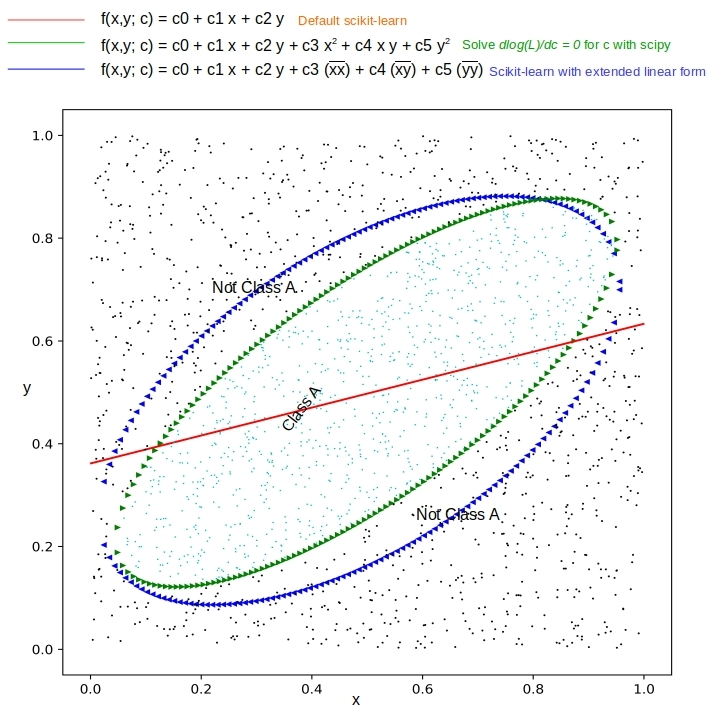
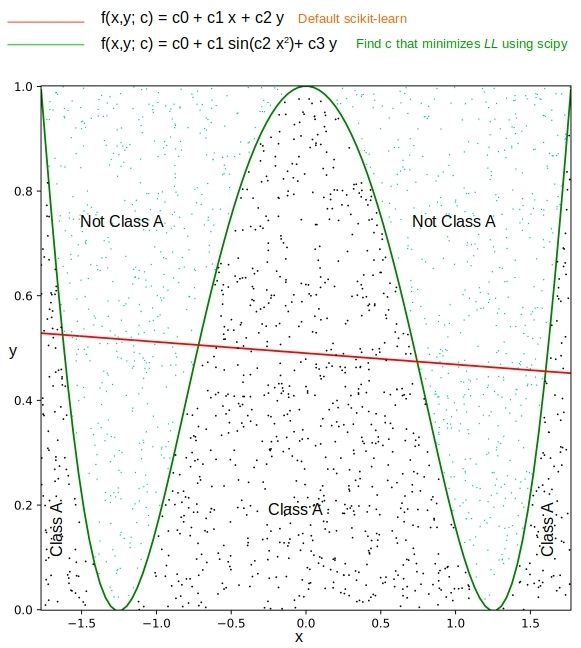

# Nonlinear Classification with Logistic Regression

This is the source code to go along with the blog article

[Nonlinear Classification with Logistic Regression](http://xplordat.com/2019/02/21/multiclass-classification-with-word-bags-and-word-sequences/)

Logistic Regression has traditionally been used a linear classifier, i.e. when the classes can be separated in the feature space by linear boundaries. The blog is about using Logistic Regression when the separation/decision boundaries may be nonlinear. 

## Dependencies

	numpy
	scikit-learn
	matplotlib
	scipy

## Usage

###	Decision boundary as a 2nd order polynomial

When the decision boundary is anticipated to be a 2nd order polynomial as below:

	f(x,y; c) = c0 * 1 + c1 * x + c2 * y + c3 * x^2 + c4 * x * y + c5 * y^2

Classify the data with:
	
	prp ./polynomial.py npoints c0 c1 c2 c3 c4 c5

The blog simulates the case when an elliptical boundary separates the classes, with 1000 data points for each class

	prp ./polynomial.py 1000 2.25 -3.0 -18.0 35.0 -64.0 50.0

To get results like:

###	Decision boundary in a generic non-polynomial form

The other non-polynomial case worked out in the article is:
	
	f(x,y; c) = c0 + c1 * sin(c2 * x^2) + c3*y

Classify this with:

	prp ./generic.py 1000 1.0 -1.0 1.0 -1.0

where once again 1000 data points are generated for each class

The predicted boundary obtains an F1 score of 1 whereas the traditional logistic regress obtains 0.675

